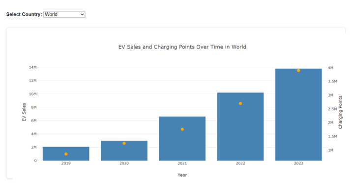
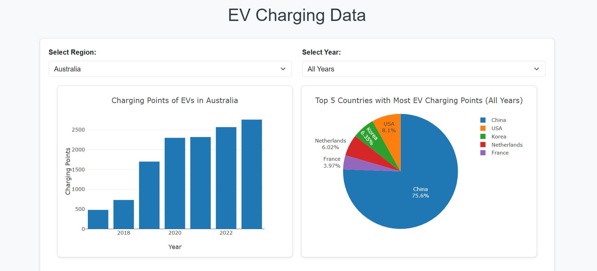

# Electric-vehicle-analysis
## Project Overview
The electric vehicle (EV) industry is undergoing rapid transformation, driven by technological advancements, environmental concerns, and evolving consumer preferences. This report provides a comprehensive analysis of the EV market, focusing on key trends, market dynamics, and emerging opportunities. EV adoption is a growing industry tied to technology, sustainability, and policy and this interactive visualization can be used in these related topics.

Objectives:
- Analyzie the global sales trends and regional adoption to find future major markets 
- Anlyzie the different types of electric cars sales trend for future insights
- What are the top countries with the highest electric vehicle sales and does the availability of charging infrastructure affect the adoption rate of electric vehicles?
- Which type of electric vehicles are sold the most across the world and is battery electric make up the most part of the global electric vehicle market share?

## Technologies Used
Python, Pandas, Flask, SQLite, Bootstrap, HTML, CSS, JavaScript

Install the necessary dependencies include:
- pandas
- pathlib
- matplotlib
- seabron
- numpy
- D3.js
- Plotly

## Usage Guide
Clone the repository:
git clone https://github.com/Jun-Jiang03/electric-vehicle-analysis/tree/main

Data folder all csv files are rare data from IEA Global EV Outlook 2024 https://www.iea.org/data-and-statistics/data-tools/global-ev-data-explorer

- part_1_data cleaning.ipynb Notebook is to clean the data and save cleaned data for EV sales historical and projection data, EV charging point historical and projection data in cleaned data folder
- part_2_data explore and analysis.ipynb Notebook is to explore the cleaned data and use seaborn to build EV sales volumes graphs over years for selected regions:'China', 'Europe', 'USA', 'Germany', 'France', 'United Kingdom' and save the graphs as pngs
- under the cleaned data folder create_sqlite.py is used to build EV database, which is 'ev_db.sqlite' in the main folder
- app.py is to connect EV database and build API routes for each tables. Users need to run python app.py in the terminal to access the database
- plot.js and index.html are to build interactive visualizations
- open the index.html in browers like Chrome or Safari, users can choose regions in the dropdown menu to see the EV sales volume and EV charging points change over years. Also, the top five country charging point makert share in the selected year.

 

## Contributors
Anjila Ghimire and Jun Jiang

## Ethical Considerations
- Clearly outline the limitations of the dataset and avoid biases
- Data is sourced from the trustful organization. The International Energy Agency (IEA), which works with governments and industry to shape a secure and sustainable energy future for all.
- Using accurate, factual, and complete data. The data practices do not lead to unjust outcomes or discrimination.

## Data sources and references
IEA Global EV Outlook 2024 https://www.iea.org/data-and-statistics/data-tools/global-ev-data-explorer
Articles about EVs:
https://www.mckinsey.com/featured-insights/mckinsey-explainers/what-is-an-ev
https://afdc.energy.gov/vehicles/fuel-cell#:~:text=Fuel%20cell%20electric%20vehicles%20
https://www.mckinsey.com/industries/automotive-and-assembly/our-insights/mckinsey-electric-vehicle-index-europe-cushions-a-global-plunge-in-ev-sales

